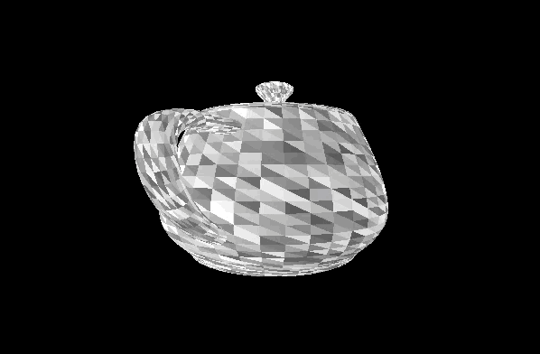

# scop [[42](https://www.42.fr/) project]


## Project
The goal of this project is to draw a 3D object with opengl in C

See more on the [subject](https://github.com/tnicolas42/scop/blob/master/scop.pdf).

## Compilation

To compile this project, just run tha Makefile
```
make -j6
```

## Usage

To get usage: `./scop`
```
Usage: ./scop <file.obj>
Keyboard shortcuts:
	<up> | <down> | <left> | <right> to move piece in screen
	<w> | <a> | <s> | <d> to move piece in screen
	[Shift] + <xyz> to move piece in axis
	<ctrl> + [Shift] + <xyz> to rotate piece in axis
	<t> to change texture
	<m> to enable or disable auto rotate
	<r> to reset position
Mouse control
	<leftClick> to move object
	<ctrl> + leftClick> | <rightClick> to rotate object
	<scrollUp> | <scrollDown> to zoom on object
```

Example
```
./scop obj_files/42.obj
```

## Textures
To change textures: `T`



## Moving
To move you can use arrows, wasd, left click or xzy.
To rotate you can use ctrl + xzy, right click or ctrl + left click.
To zoom/dezoom you can use +- or you can scroll.


